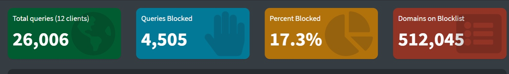
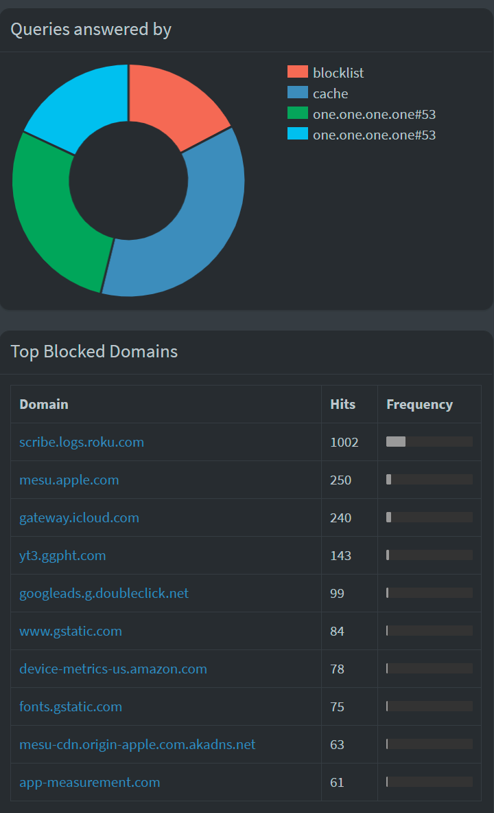
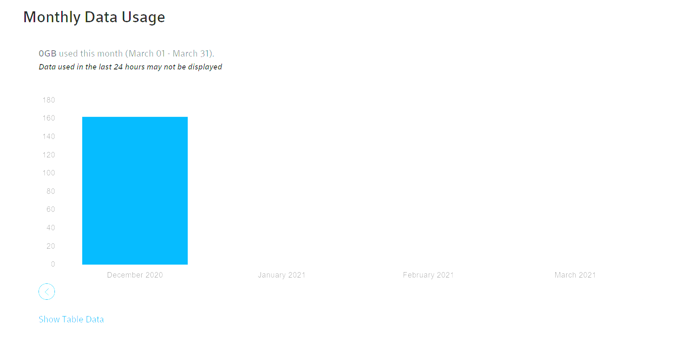
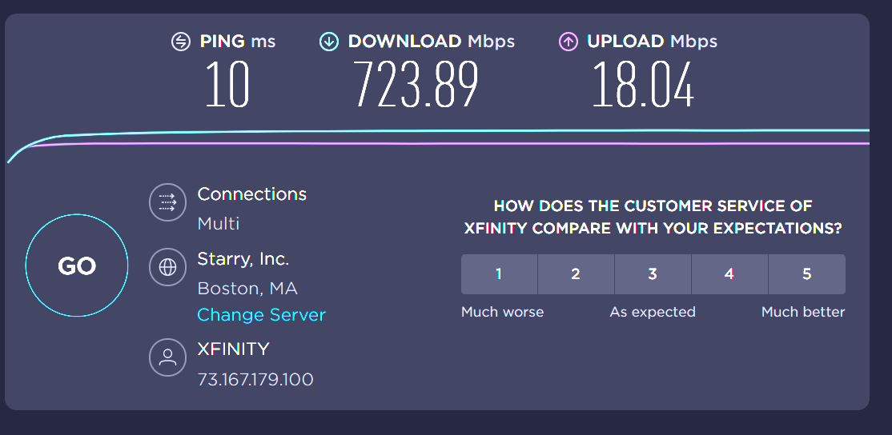

---

title: 'How I Beat My ISP'
author: [jjhickman]
tags: ['Pihole', 'DNS', 'Raspberry Pi']
image: img/pihole-overview.png
date: '2021-03-25T22:53:17.000Z'
draft: false
layout: post
excerpt: That title isn't clickbait! It may have been a fluke by my ISP that may be corrected in the future, but for now I am David and I just bested Goliath.
---

## Pihole and You

**Wow**

## HTTPS over DNS

CLOUDFLARE IS DOPE

## Defeating Goliath

***Wow***

***BOOM***

